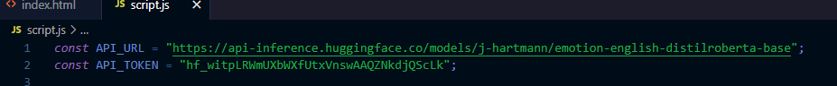

# 🤖 Proyecto Final - Introducción a la Inteligencia Artificial

Este proyecto muestra un ejemplo práctico de implementación de un bot con IA.  
A continuación se detallan los pasos importantes para configurar y ejecutar correctamente el proyecto.

---

## ⚙️ Pasos para ejecutar el proyecto

1. **Clonar o descargar el repositorio**  
   Asegúrate de que todos los archivos estén descargados correctamente.

2. **Configurar la API del bot**  
   - Abre el archivo `script`.
   - Localiza las líneas 1 y 2 donde se encuentra la API del bot comentada.
   - **Quita los comentarios** (`//`) para habilitar la API y permitir que el bot funcione.

3. **Revisar la API correctamente**  
   - Verifica que la API esté tal cual aparece en la imagen adjunta.  
   - Se recomienda **eliminar los espacios adicionales** que se agregaron para evitar bloqueos al subir la API a un repositorio público.

---

## 📸 Captura de referencia

---

> Nota: La API es sensible y se debe manejar con cuidado para no ser bloqueada en repositorios públicos.
